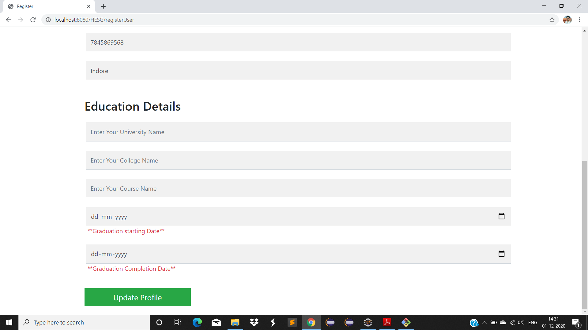
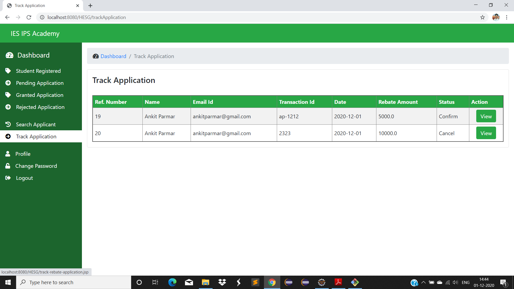

# Student-Utility-Fund-System
* The project titled as “Student Utility Fund System” will be developed in Java and MySQL as back end. This project will help to maintain the information regarding the expenses
  that are being used by students in order to develop some excellent projects. 
* Once they are done with all the things required by them, then they need to submit softcopy of receipt andthen fund will be granted by the Institution to them. 
  The main process in this procedure will be login and Profile creation after that you will become eligible for taking funds.

Student Dashboard

Admin Dashboard

